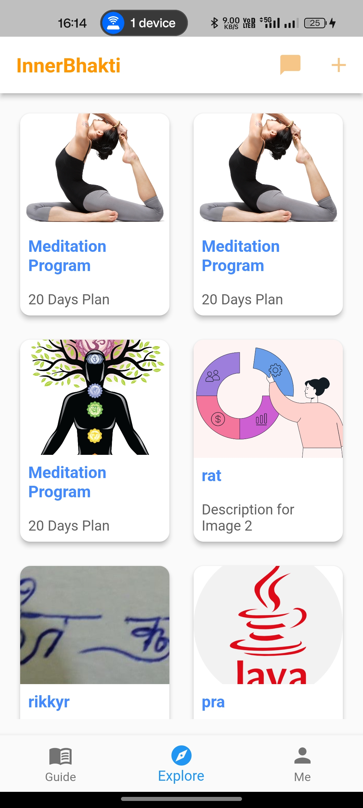
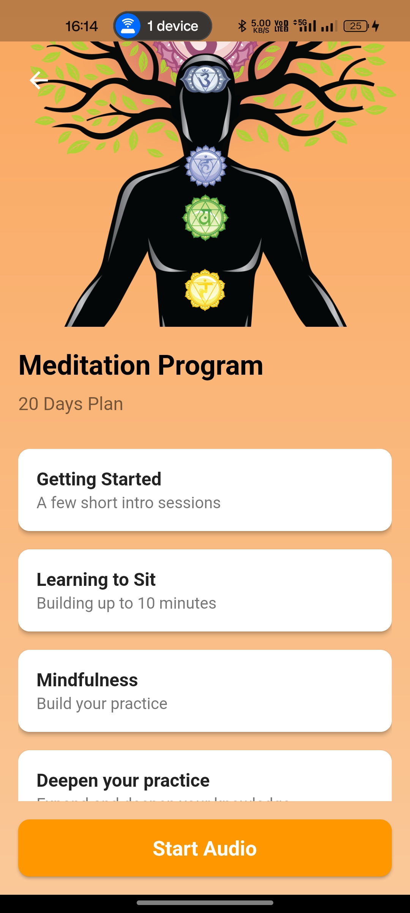

# InnerBhakti App

InnerBhakti is a spiritual guidance app designed to provide users with a seamless experience for exploring programs, accessing details, and enjoying audio tracks. This repository includes the backend API (Node.js) and the mobile frontend (Flutter).

## Features

### Frontend (Flutter)
- **Program List Screen**: Displays a list of spiritual programs with their details.
- **Program Details Screen**: Fetches and displays tracks associated with a selected program.
- **Audio Player Screen**: Includes playback controls (play, pause, forward, rewind) for tracks.

### Backend (Node.js)
- **REST APIs**: 
  - Fetch program list.
  - Fetch program details.
  - Upload files (single and multiple).
  - Stream or fetch audio tracks.
- **Database**: MongoDB for managing program and track data.
- **Cloud Storage**: Integration with AWS or other cloud services for storing and accessing audio files.

## Backend Routes

### Program Routes
- **`GET /programs`**: Fetch all programs.
- **`GET /programs/:id`**: Fetch program details by ID.

### Audio Routes
- **`GET /audios`**: Fetch all audio tracks.
- **`GET /audios/:id`**: Fetch a specific audio track by ID.

### Upload Routes
- **`POST /upload/single`**: Upload a single file.
- **`POST /upload/multiple`**: Upload multiple files.

## Screenshot Options
To document and share your work visually, follow these steps:
1. Take screenshots of:
   - Program List Screen
   - Program Details Screen
   - Audio Player Screen
2. Save the images in a directory called `screenshots/`.
3. Include these screenshots in the **README.md** using the markdown syntax:
   ```markdown
   
   
   
   ```

## Tech Stack
- **Frontend**: Flutter (Dart)
- **Backend**: Node.js (Express.js)
- **Database**: MongoDB
- **Cloud Hosting**: AWS or Vultr (for backend and audio files)

## Setup Instructions

### Prerequisites
- **Flutter**: Install from [Flutter's official website](https://flutter.dev).
- **Node.js**: Install from [Node.js official website](https://nodejs.org).
- **MongoDB**: Install locally or use a cloud MongoDB instance.
- **Cloud Account**: AWS/Vultr for audio file storage.

### Backend Setup
1. Navigate to the `backend/` folder.
2. Install dependencies:
   ```bash
   npm install
   ```
3. Configure environment variables in `.env`:
   - MongoDB connection string
   - Cloud storage credentials
4. Start the server:
   ```bash
   npm run dev
   ```

### Frontend Setup
1. Navigate to the `frontend/` folder.
2. Get Flutter dependencies:
   ```bash
   flutter pub get
   ```
3. Run the app:
   ```bash
   flutter run
   ```
